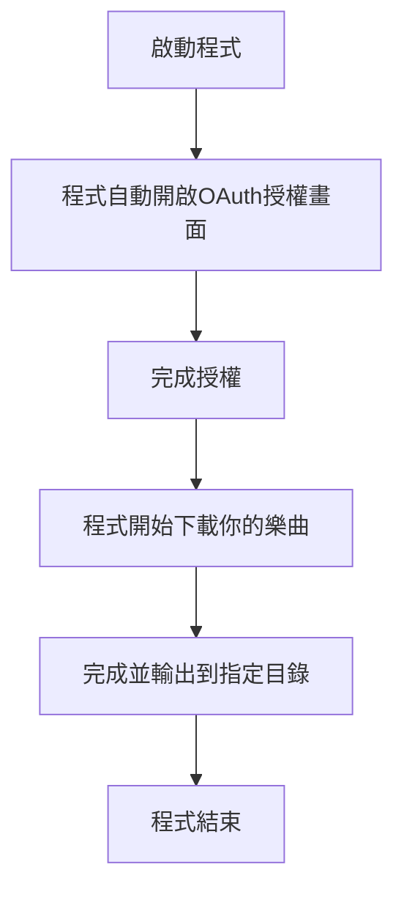

# Soptify 按讚樂曲下載器

## 注意事項
此程式依賴`yt-dlp`，請確保有正確安裝

## 設置

- .env中的每個欄位都需要填寫，除了`COOKIES_FILE_PATH`和`MAX_THREADS`
- `SPOTIFY_CLIENT_ID`和`SPOTIFY_CLIENT_SECRET`需要到 [Spotify 開發者面板](https://developer.spotify.com/) 申請
- `MAX_THREADS`建議不要超過CPU線程數，最好設置為 `CPU線程數 - 2`
- `COOKIES_FILE_PATH`是為了避免大量下載時 Youtube 將你判定為機器人，需要遵守`Netscape`格式規範

## 安裝與使用

1. `git clone git@github.com:aluo96078/spotify-liked-downloader.git`
2. `go mod tidy`
3. `go run .`

## 使用流程

## 特別銘謝

- 靈感來源 [spotify-downloader](https://github.com/spotDL/spotify-downloader)
- YoutubeSearcher 套件封裝 @miyago9267 - [ytvser](https://github.com/miyago9267/ytvser)

## 授權

此專案使用 [MIT 授權](LICENSE)